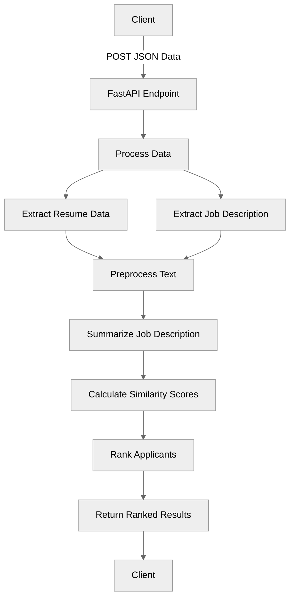

# ATS Scan System - Applicant Tracking System Scanner

## Overview
The ATS Scan System is a FastAPI-based application that analyzes and ranks job applicants based on their similarity to a job description using natural language processing techniques.

## Features
- Extracts and preprocesses resume data from multiple fields
- Processes job descriptions and creates summaries
- Calculates similarity scores using n-gram matching
- Ranks applicants based on their match score
- Provides a REST API endpoint for processing requests

## System Architecture

